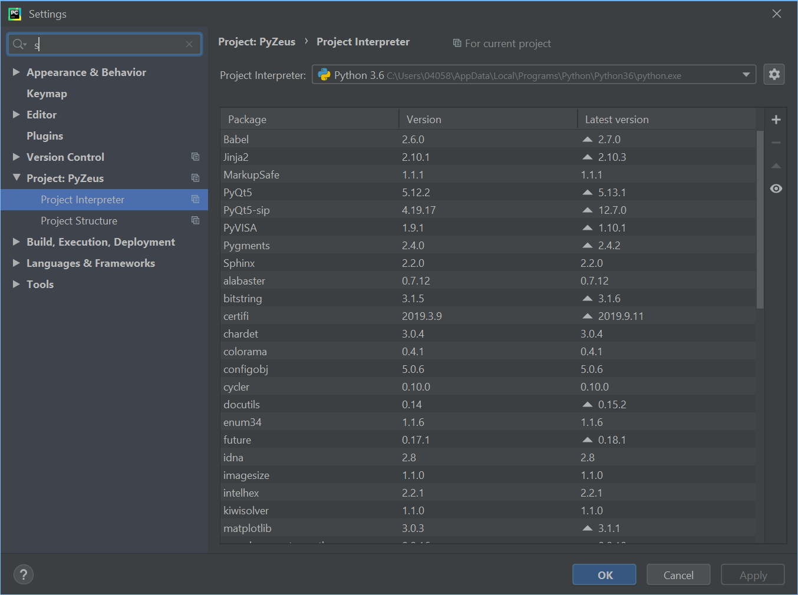

Overview
========
This package encapsulates the access to a Lecroy oscilloscope. It provide basic function in order to communicate
with the device.

This package can be used only on Windows 32/64 platform.

Installation
============
You will need `Python 3+ <https://www.python.org>`_

This package use the ActiveDSO active X control from lecroy, you need to install it in your PC workstation.

In order to interface python with COM object, you need to install win32com package.

* `pywin32 <https://pypi.org/project/pywin32/>`_

The following packages are also needed:

* `numpy <https://numpy.org/>`_
* `matplotlib <https://matplotlib.org/>`_

To install these packages use the following command:

.. code-block:: bash

    $ pip install <package>

Is you are using PyCharm IDE, this package can be install using **File -> Settings...**
This will open a window where you can add packages:

* Go to *Project: <your_project_name>*
* Go to *Project Interpreter*

A list of installed packages are showed, you can add, delete and update packages.

Package development
=====================

The code of the package is developed under :file:`pylecroy` directory.

If you are developing new features inside the package, please follow `PEP8 <https://www.python.org/dev/peps/pep-0008/>`_

Note that package will be used by other people, so stability matters.

* Follow `PEP20 <https://www.python.org/dev/peps/pep-0020/>`_

.. code-block:: rest

    Beautiful is better than ugly.
    Explicit is better than implicit.
    Simple is better than complex.
    Complex is better than complicated.
    Flat is better than nested.
    Sparse is better than dense.
    Readability counts.
    Special cases aren't special enough to break the rules.
    Although practicality beats purity.
    Errors should never pass silently.
    Unless explicitly silenced.
    In the face of ambiguity, refuse the temptation to guess.
    There should be one-- and preferably only one --obvious way to do it.
    Although that way may not be obvious at first unless you're Dutch.
    Now is better than never.
    Although never is often better than *right* now.
    If the implementation is hard to explain, it's a bad idea.
    If the implementation is easy to explain, it may be a good idea.
    Namespaces are one honking great idea -- let's do more of those!

In order to update the documentation, you need :program:`sphinx`.